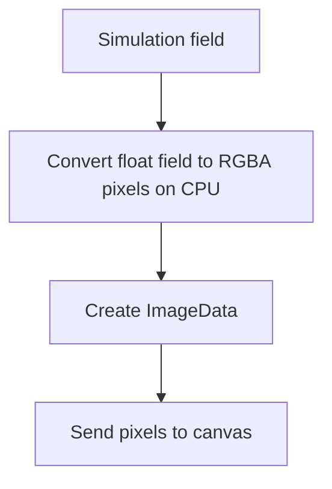

# Browser and SIMD Experiments

## Why separate browser experiments from solver experiments?

Because browser work includes costs that pure numerical kernels do not.

For example:

- converting a field to pixels,
- creating `ImageData`,
- uploading to canvas,
- moving compute off the main thread.

If you mix those costs with solver-only timing, the result becomes hard to
interpret.

## What was measured in the browser render page?

The browser render benchmark separates:

- field-to-RGBA conversion,
- `new ImageData(...)`,
- `putImageData`,
- OffscreenCanvas-related paths.

That is useful because it tells you where browser-side overhead actually sits.

The major result was:

- field-to-RGBA conversion was the dominant render-side cost,
- direct canvas upload was comparatively small for the tested setup.

This is part of the CPU-focused story. The page is not using a GPU shader
pipeline here. It is doing CPU-side field conversion and then using ordinary
browser image/canvas paths. That makes the cost breakdown easier to inspect.

## Why do manual Chrome and headless Chrome both exist?

Because they answer different questions.

Manual browser run:

- closer to visible user-facing behavior.

Headless browser run:

- easier to script,
- easier to rerun consistently,
- better for repeatable engineering checks.

The repo deliberately keeps those tables separate.

## Browser-side compute flow

That is why rendering has its own measurable costs beyond the solver itself.

## What was the SIMD experiment trying to prove?

Not that SIMD is magical.

The goal was to test whether a dedicated `simd128` WASM build could make the
same solver materially faster while staying numerically aligned with the scalar
path.

That required two things:

- correctness comparison first,
- benchmark second.

That ordering matters. A fast wrong answer is not a scientific result.

## Why keep scalar and SIMD as separate builds?

Because it makes the comparison cleaner.

- scalar remains the readable reference path,
- SIMD remains the optimized path,
- validation can compare them directly.

That is better for research artifacts than hiding the optimization inside one
code path with unclear behavior.

## Why is the Web Worker experiment important?

It changes the browser story from:

> “The inverse loop can run in a browser.”

to:

> “The inverse loop can run in a browser without blocking the main page during
> the heavy computation.”

That is a stronger systems result, even if the numerical result is the same.

## Why not add GPU rendering or GPU compute right now?

Because that would answer a different question.

GPU rendering, WebGPU, or shader-based simulation could be worthwhile future
work. But they would introduce new moving parts:

- different APIs,
- more backend-specific behavior,
- more browser compatibility questions,
- a harder comparison against the current CPU-side artifact.

For this repo, the cleaner result is:

- CPU-side rendering costs were measured,
- CPU-side inverse execution was demonstrated,
- WASM SIMD improved compute throughput,
- the browser path stayed understandable enough to teach.
