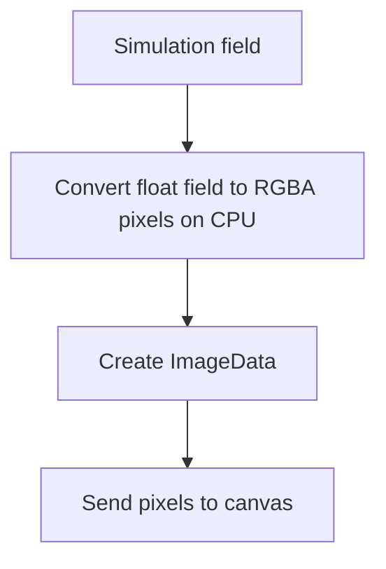

# Browser and SIMD Experiments

## The question on this page

This page answers:

> What changes when the trusted forward and inverse code paths become actual
> browser-deliverable pages?

It also covers the SIMD experiment here because that result sits between two
worlds:

- mathematically it is the same solver,
- experimentally it is about a different execution path.

## Why separate browser experiments from solver experiments?

Because browser work includes costs that pure numerical kernels do not.

For example:

- converting a field to pixels,
- creating `ImageData`,
- uploading to canvas,
- moving compute off the main thread.

If you mix those costs with solver-only timing, the result becomes hard to
interpret.

## Experiment 1: browser render harness

### Why this exists

The browser render page asks:

> If the solver field already exists, what does it cost to turn that field into
> something the browser can actually draw?

### What was measured

The benchmark separates:

- field-to-RGBA conversion,
- `new ImageData(...)`,
- `putImageData`,
- OffscreenCanvas-related paths.

Terms used repeatedly on this page:

- **field to RGBA**:
  convert numerical solver values into pixel bytes the browser can draw.
- **ImageData**:
  browser image container built from the RGBA pixel buffer.
- **putImageData**:
  upload raw pixels into a 2D canvas.
- **OffscreenCanvas**:
  canvas path that can be used away from the visible DOM canvas.
- **ImageBitmap transfer**:
  transfer-based drawing path using an intermediate bitmap object.
- **headless Chrome**:
  Chrome running without an interactive visible window, useful for scripted
  checks.

### Why this matters

This is useful because it tells you where browser-side overhead actually sits.

If you only time "one frame," you cannot tell whether the cost came from:

- numerical work,
- pixel conversion,
- image object creation,
- canvas upload,
- or worker/main-thread behavior.

### What happened

The major result was:

- field-to-RGBA conversion was the dominant render-side cost,
- direct canvas upload was comparatively small for the tested setup.

Manual Chrome median render table:

| Grid | Field to RGBA | new ImageData | 2D putImageData | OffscreenCanvas putImageData | OffscreenCanvas ImageBitmap transfer |
| --- | ---: | ---: | ---: | ---: | ---: |
| 128x128 | 0.084000 | 0.000333 | 0.010667 | 0.009333 | 0.016000 |
| 256x256 | 0.205333 | 0.000000 | 0.027333 | 0.021000 | 0.027000 |
| 512x512 | 0.817000 | 0.000333 | 0.093333 | 0.094333 | 0.099667 |

This is part of the CPU-focused story. The page is not using a GPU shader
pipeline here. It is doing CPU-side field conversion and then using ordinary
browser image/canvas paths. That makes the cost breakdown easier to inspect.

### Tradeoff

This CPU-first render path is not the fastest possible visual pipeline, but it
is easier to measure and explain than a shader-driven one.

Protocol:

- Chrome manual page,
- `300` frames,
- `250` warmup steps,
- `3` runs per grid,
- grids: `128`, `256`, `512`.

## Experiment 2: manual Chrome vs headless Chrome

### Why this exists

Manual and headless runs answer different questions.

Manual browser run:

- closer to visible user-facing behavior.

Headless browser run:

- easier to script,
- easier to rerun consistently,
- better for repeatable engineering checks.

The repo deliberately keeps those tables separate.

### What happened

The checksums matched across the manual and headless render runs, which is the
important trust result.

The timings did not match exactly, especially for the direct canvas upload
numbers. That is also important. It means:

- headless Chrome is useful for repeatability,
- but it should not be treated as identical to interactive browser behavior.

Protocol:

- scripted local Chrome launch,
- same `300` frames and `250` warmup steps,
- same three grids,
- same checksum checks as the manual path.

Headless Chrome median render table:

| Grid | Field to RGBA | new ImageData | 2D putImageData | OffscreenCanvas putImageData | OffscreenCanvas ImageBitmap transfer |
| --- | ---: | ---: | ---: | ---: | ---: |
| 128x128 | 0.052667 | 0.000333 | 0.002000 | 0.002000 | 0.007000 |
| 256x256 | 0.191333 | 0.000333 | 0.006000 | 0.006333 | 0.016667 |
| 512x512 | 0.779333 | 0.000333 | 0.022667 | 0.023000 | 0.124333 |

## Browser-side compute flow

That is why rendering has its own measurable costs beyond the solver itself.

## Experiment 3: SIMD WASM forward kernel

### Why this exists

The SIMD experiment asks:

> If we keep the same solver math and same WASM environment, can explicit
> vectorization reduce forward runtime substantially?

### What happened

It did.

The SIMD `run_simd` path delivered a large speedup over the scalar WASM path in
the logged Node.js runs while preserving single-precision agreement.

SIMD benchmark table:

| Grid | Scalar ms/step | SIMD ms/step | SIMD speedup |
| --- | ---: | ---: | ---: |
| 128x128 | 0.119010 | 0.016002 | 7.44x |
| 256x256 | 0.473616 | 0.055237 | 8.57x |
| 512x512 | 1.910463 | 0.273835 | 6.98x |

### Why this matters

This isolates an important lesson:

- the biggest win did not come from the word "WASM" by itself,
- it came from changing how the computation is executed inside the WASM path.

### Tradeoff

- **good**: large constant-factor speedup.
- **bad**: more specialized implementation, and the browser numbers for SIMD
  are still more environment-sensitive than the Node path.

Related terms:

- **scalar path**:
  ordinary one-value-at-a-time computation.
- **SIMD path**:
  one instruction applied across several values at once.

## Why keep scalar and SIMD as separate builds?

Because it makes the comparison cleaner.

- scalar remains the readable reference path,
- SIMD remains the optimized path,
- validation can compare them directly.

That is better for research artifacts than hiding the optimization inside one
code path with unclear behavior.

## Experiment 4: browser inverse page

### Why this exists

The browser inverse page asks:

> Can the same backtracking AD inverse loop used in the native experiments be
> exposed as an actual browser-facing workflow?

### What happened

Yes.

The page accepts user parameters, runs the exported inverse optimizer, and
reports:

- final recovered `F/k`,
- clean loss,
- evaluation count,
- optimizer history.

Protocol:

- same AD-line inverse method as the native artifact,
- browser page front-end,
- exported WASM function behind the page,
- worker-backed execution path.

Node-side smoke result for the same exported inverse function:

| Final F | Final k | Final clean loss | Evaluated | History steps |
| ---: | ---: | ---: | ---: | ---: |
| 0.05989385 | 0.062670857 | 1.7397373e-7 | 17 | 9 |

### Why this matters

This changes the project from:

- "the inverse method exists in a Rust binary"

to:

- "the inverse method is actually browser-deliverable."

## Experiment 5: Web Worker browser inverse path

### Why this exists

The first browser inverse question is numerical:

> Does it run?

The second is systems-oriented:

> Does it run without freezing the page?

That is why the worker path matters.

### What happened

The heavy inverse call was moved into `www/inverse_worker.js`, and the returned
status reports `worker: true`.

### Why this matters

The numerical method is unchanged, but the usability story is stronger:

- browser inverse now works off the main UI thread.

It changes the browser story from:

> “The inverse loop can run in a browser.”

to:

> “The inverse loop can run in a browser without blocking the main page during
> the heavy computation.”

That is a stronger systems result, even if the numerical result is the same.

## Experiment 6: automated headless browser inverse benchmark

### Why this exists

The browser inverse page needs a repeatable timing path, not only a manual UI
demo.

### What the metric means

- **elapsed ms**: total worker-side inverse call time after WASM init,
- **ms/iteration**: rough optimizer-step cost,
- **ms/evaluation**: rough cost per forward-solve-based loss evaluation,
- **worker = yes**: confirms the measured path is off the main thread.

Protocol:

- headless Chrome,
- fixed target `F=0.06055`, `k=0.06245`,
- initial guess `F=0.06000`, `k=0.06300`,
- `8` optimizer iterations,
- zero added noise in the timing run.

### What happened

The full browser inverse loop ran headlessly at multiple grid sizes, and the
time scaled upward in the way you would expect from repeated forward solves.

Headless browser inverse timing:

| Grid | Evaluations | Worker | Elapsed ms | ms/iteration | ms/evaluation | Final clean loss |
| --- | ---: | :---: | ---: | ---: | ---: | ---: |
| 32x32 | 21 | yes | 22.200000 | 2.466667 | 1.057143 | 6.884e-7 |
| 64x64 | 17 | yes | 68.000000 | 7.555556 | 4.000000 | 1.740e-7 |
| 96x96 | 17 | yes | 142.800000 | 15.866667 | 8.400000 | 1.737e-7 |

### Tradeoff

These are still headless Chrome timings on one machine. They are good
engineering evidence, not universal browser-performance truth.

## Why not add GPU rendering or GPU compute right now?

Because that would answer a different question.

GPU rendering, WebGPU, or shader-based simulation could be worthwhile future
work. But they would introduce new moving parts:

- different APIs,
- more backend-specific behavior,
- more browser compatibility questions,
- a harder comparison against the current CPU-side artifact.

For this repo, the cleaner result is:

- CPU-side rendering costs were measured,
- CPU-side inverse execution was demonstrated,
- WASM SIMD improved compute throughput,
- the browser path stayed understandable enough to teach.
