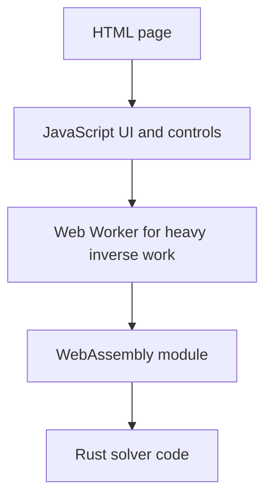
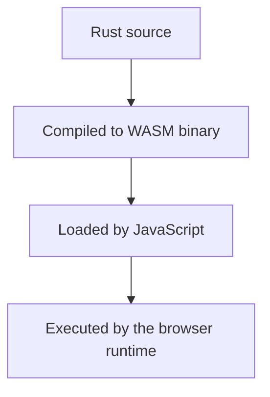
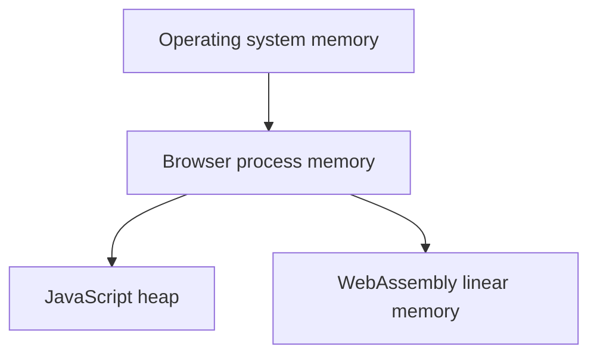

# Common Questions

## Why was this project CPU-focused? Is GPU bad?

No. GPU compute is powerful and often the right choice for large simulation and
machine-learning workloads.

This project stayed CPU-focused for a different reason:

- the goal was a small, inspectable research artifact,
- the same solver should run natively and in the browser,
- the measurements should stay easy to reproduce on an ordinary machine,
- adding GPU backends would introduce much more system complexity.

So the claim is **not**:

> CPUs are better than GPUs.

The claim is:

> A CPU-only Rust/WASM artifact can still do meaningful forward, rendering, and
> small inverse-problem work in a browser-deliverable form.

That is a narrower and more honest research statement.

## Why not use Python if scientific computing already uses Python a lot?

Python is excellent for scientific work. This repo even uses Python and NumPy as
reference checks.

But Python alone does not answer the artifact question here. The project wanted:

- one main solver implementation,
- native execution,
- browser execution,
- explicit memory layout,
- a credible systems story around WASM, workers, and SIMD.

Rust fits that goal better than a Python-only stack.

## Does “browser-deliverable” just mean “JavaScript”?

Not in this repo.

The browser app is a mix of layers:

JavaScript still matters. It owns:

- the page,
- the input controls,
- browser APIs like canvas and workers,
- the command flow between UI and compute.

But the heavy numerical work is handled by the Rust code compiled to WASM.

## Is WebAssembly just “Rust running inside the browser”?

Close, but be a little more precise.

Rust source is compiled into a WebAssembly binary module. The browser loads that
module and executes it inside the browser's sandboxed runtime.

So the execution path is better described as:

## Does WASM use OS memory directly?

Not directly in the way a native unrestricted process can.

The browser process itself uses operating-system memory. Inside that process,
the WASM module gets a **linear memory** region managed by the runtime.

You can picture it like this:

Important consequences:

- the browser runtime decides the boundaries,
- the WASM module cannot just read arbitrary OS memory,
- JavaScript can create typed-array views into the WASM memory buffer,
- the repo uses those views to avoid copying whole fields unnecessarily.

So yes, the bytes ultimately live in RAM provided by the OS, but the WASM code
does **not** get free direct access to all machine memory.

## Why is zero-copy access such a big deal here?

Because simulation fields can be large, and repeated copying is expensive.

If JavaScript asked WASM to hand back a brand new copied array every time:

- more memory traffic would happen,
- more time would be spent copying,
- browser-side performance conclusions would get muddied.

Using typed-array views into WASM memory lets JavaScript inspect the data
without cloning the whole field each time.

That is why the JS/WASM boundary is a real systems topic in this project, not a
small implementation footnote.

## Does the browser worker create another copy of everything?

Not automatically.

The worker is a separate browser execution context. It runs the inverse logic
off the main thread. Messages still pass between the page and the worker, but
the important numerical work stays inside the worker-side WASM instance.

That means the main page stays responsive while the heavy optimization runs.

## Why not measure everything only in the browser?

Because different questions need different environments.

Native and Node.js runs are useful for:

- solver validation,
- forward-kernel timing,
- scalar vs SIMD comparison.

Browser runs are useful for:

- rendering cost,
- UI responsiveness,
- worker-backed inverse execution,
- proof that the artifact really works as a browser experience.

If those environments were mixed carelessly, the measurements would become hard
to interpret.

## Why was the inverse problem kept so small?

Because a clean small problem is better than an inflated messy one.

The project only tries to recover two scalar parameters:

- `F`
- `k`

It does **not** try to recover:

- the whole initial field,
- diffusion coefficients,
- a time-varying control signal,
- a large parameter vector.

That limited scope is what makes the comparison between grid search, finite
differences, and forward-mode AD readable and defensible.

## If GPU support were added later, would that make this work obsolete?

No.

It would answer a different question.

This repo currently shows:

- correctness,
- browser delivery,
- CPU-side systems design,
- small inverse recovery,
- SIMD acceleration inside WASM.

A later GPU version would extend the artifact. It would not erase the value of
the current CPU/WASM result.
