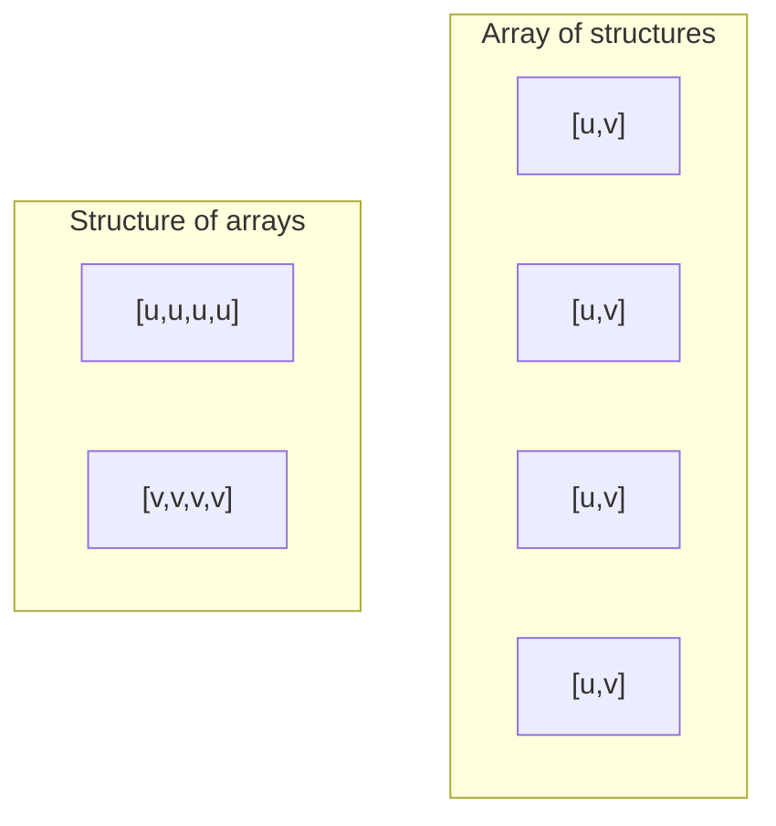
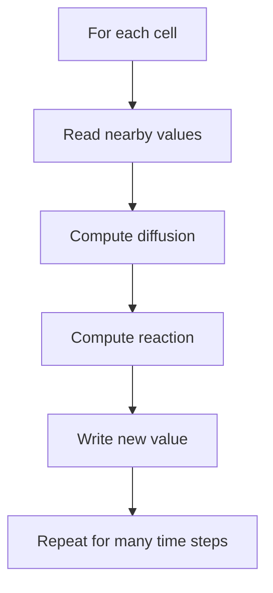
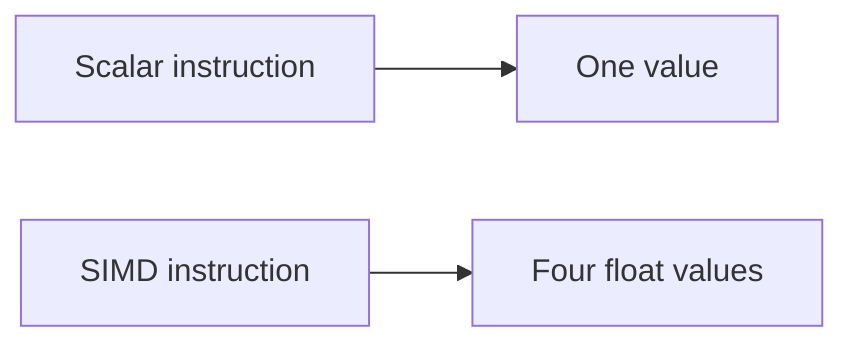

# Computer Science Concepts

## Structure of Arrays

The solver stores values in separate arrays for `u` and `v`.

That is called **structure of arrays** rather than **array of structures**.

Why it helps:

- the code reads contiguous values from one field at a time,
- the stencil math stays simple,
- memory access is friendlier for numerical kernels.

Picture the contrast like this:

The second layout is often easier to optimize for field-wise numerical work.

## Stencil Computation

A stencil update means each cell is updated using nearby cells.

This repo uses a 5-point stencil:

- center
- left
- right
- up
- down

That is a common pattern in grid-based numerical computing.

You can think of the whole solver as:

## Periodic Boundary Conditions

When the solver reaches an edge, it wraps around to the other side.

That means:

- left edge neighbors can come from the right edge,
- top edge neighbors can come from the bottom edge.

This is called a **periodic boundary**.

## Benchmarking

A benchmark is not just “run it once and see a time.”

Good benchmarking asks:

- what exactly is being timed,
- how many trials were run,
- whether the result is a median or a single measurement,
- whether setup costs were included,
- whether different environments are being mixed unfairly.

This repo takes that seriously:

- Node.js and browser timings are separated,
- scalar and SIMD are checked against each other,
- manual browser and headless browser measurements are not merged blindly.

## Automatic Differentiation

Automatic differentiation, or AD, is a way to compute derivatives by propagating
derivative information through the actual program.

That is different from:

- symbolic differentiation, which manipulates formulas,
- finite differences, which estimate derivatives by rerunning the function with
  tiny input changes.

The repo uses **forward-mode AD** because the inverse problem only has two main
parameters: `F` and `k`.

That decision is important. Forward-mode AD is a good fit when the number of
input parameters is small. If the project tried to infer a huge parameter
vector, the tradeoffs would change.

## Inverse Problems

A forward problem says:

> Given parameters, compute the outcome.

An inverse problem says:

> Given the observed outcome, infer the parameters.

Inverse problems are usually harder, because:

- the mapping can be ambiguous,
- noise changes the answer,
- optimization can be unstable,
- some parameters matter more than others.

## SIMD

SIMD means **single instruction, multiple data**.

In plain language:

- one operation acts on several values at once.

This repo’s WASM SIMD path uses 4-wide `f32x4` vector operations on interior
rows. That is why the project has a separate scalar path and SIMD path.

You can picture that idea like this:

That does not remove all overhead, but it can reduce the work per grid row.

## Headless Browser Benchmarking

Headless Chrome means Chrome is running without opening the usual visible window.

Why use it:

- easier automation,
- repeatable scripts,
- cleaner local benchmarking.

Why not trust it blindly:

- it is still only one browser engine,
- it may behave differently from an interactive visible browser session,
- it may not represent mobile performance.

## Sandboxing

Browsers do not let random page code behave like unrestricted native software.

That is a feature, not a weakness.

The browser sandbox means:

- the page cannot freely read arbitrary files,
- the WASM module cannot freely read arbitrary OS memory,
- privileged operations must go through browser APIs and permissions.

So “browser-deliverable scientific computing” always lives inside a more
restricted environment than a normal native binary.
