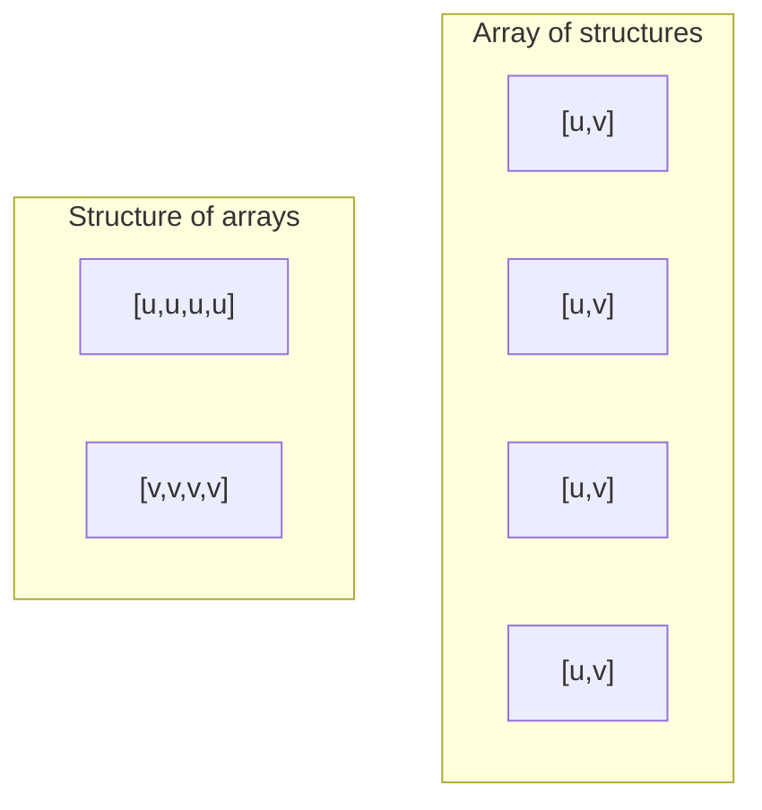
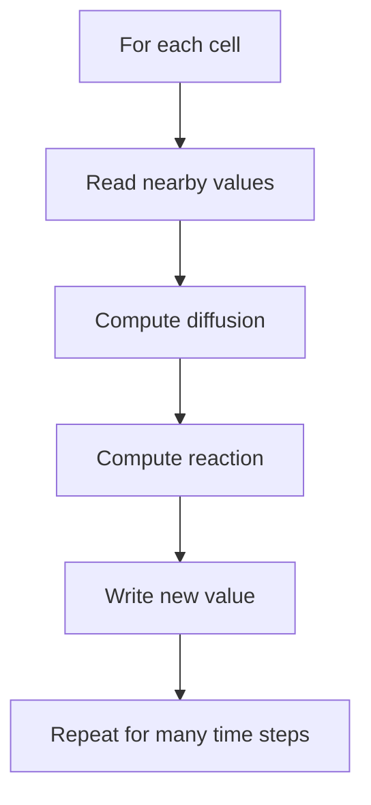
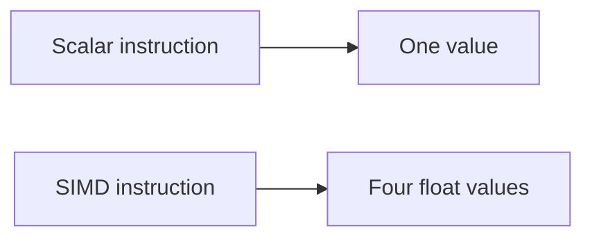

# Data and Solver Basics

This page is not meant to turn you into a systems programmer in one sitting.
The goal is simpler:

> if you read the codebase after this chapter, the main implementation ideas
> should feel recognizable instead of mysterious.

## Small Rust Basics You Actually Need Here

You do **not** need all of Rust to read this repo. A few ideas go a long way:

- a `struct` is a named bundle of related data,
- an `impl` block is where methods for that type are defined,
- a `Vec<f32>` is a growable array of 32-bit floats,
- a slice like `&[f32]` is a borrowed view of existing array data,
- `&mut` means the code is allowed to change the data through that reference.

That is enough to make sense of most of the solver and inverse code.

## Solver State

The main solver object stores:

- grid size,
- current `u` field,
- current `v` field,
- next-step `u` field,
- next-step `v` field.

So when you see the `GrayScott` struct, think:

> this is the live simulation state plus the scratch space needed for the next
> update.

## Structure of Arrays

The solver stores values in separate arrays for `u` and `v`.

That is called **structure of arrays** rather than **array of structures**.

Why it helps:

- the code reads contiguous values from one field at a time,
- the stencil math stays simple,
- memory access is friendlier for numerical kernels.

Picture the contrast like this:

The second layout is often easier to optimize for field-wise numerical work.

In this repo, that idea shows up in the separate `u` and `v` arrays inside the
solver, rather than storing one giant list of tiny `{u, v}` records.

## Stencil Computation

A stencil update means each cell is updated using nearby cells.

This repo uses a 5-point stencil:

- center
- left
- right
- up
- down

That is a common pattern in grid-based numerical computing.

You can think of the whole solver as:

In very light math language, the stencil is acting like a local weighted
"nearby influence" rule. The center cell does not update from nowhere. It
updates by combining its own old value with information from nearby cells.

## Double Buffering

One subtle but important idea in the solver is **double buffering**.

The code keeps:

- the current field arrays,
- and separate "next" field arrays.

Why?

Because if you updated the current grid in place, the later cells in the loop
would start reading partially updated values from earlier cells. That would
change the meaning of the simulation.

So the safer pattern is:

1. read from the current arrays,
2. write into separate next arrays,
3. swap them at the end of the step.

That is exactly what the solver does with `u`, `v`, `next_u`, and `next_v`.

## Periodic Boundary Conditions

When the solver reaches an edge, it wraps around to the other side.

That means:

- left edge neighbors can come from the right edge,
- top edge neighbors can come from the bottom edge.

This is called a **periodic boundary**.

In code, this shows up as index wrap logic like:

- if `x == 0`, go to the far right for the left neighbor,
- if `y == 0`, go to the bottom for the upper neighbor.

That is why the simulation behaves like a wrapping surface instead of a hard
edged picture.

## Automatic Differentiation

Automatic differentiation, or AD, is a way to compute derivatives by propagating
derivative information through the actual program.

That is different from:

- symbolic differentiation, which manipulates formulas,
- finite differences, which estimate derivatives by rerunning the function with
  tiny input changes.

The repo uses **forward-mode AD** because the inverse problem only has two main
parameters: `F` and `k`.

That decision is important. Forward-mode AD is a good fit when the number of
input parameters is small. If the project tried to infer a huge parameter
vector, the tradeoffs would change.

Beginner translation:

- a derivative tells you how sensitive an output is to an input,
- AD computes that sensitivity by carrying extra derivative information through
  the real program,
- this repo uses that to ask how the final pattern changes when `F` or `k`
  changes.

In the inverse code, that derivative information is carried through a small
dual-number style representation. You do not need to memorize the details, but
the key idea is:

> the program tracks both the normal value and how that value changes with
> respect to the chosen parameters.

## SIMD

SIMD means **single instruction, multiple data**.

In plain language:

- one operation acts on several values at once.

This repo’s WASM SIMD path uses 4-wide `f32x4` vector operations on interior
rows. That is why the project has a separate scalar path and SIMD path.

You can picture that idea like this:

That does not remove all overhead, but it can reduce the work per grid row.

In this repo, SIMD is used only where it fits cleanly:

- interior rows use 4-wide vector math,
- awkward boundary handling falls back to the scalar path.

That is a common engineering pattern:

> optimize the regular hot path, keep the weird edge cases correct.

## Floating-Point Types

The solver mostly uses `f32`, which means 32-bit floating-point numbers.

Why not just use integers?

Because the simulation values are continuous quantities, not simple counts.

Why not always use `f64`?

Because `f32` is smaller, often faster, and matches the browser-side
typed-array path more naturally for this artifact.

That is also why comparisons against NumPy `float32` are meaningful in the
validation scripts.
