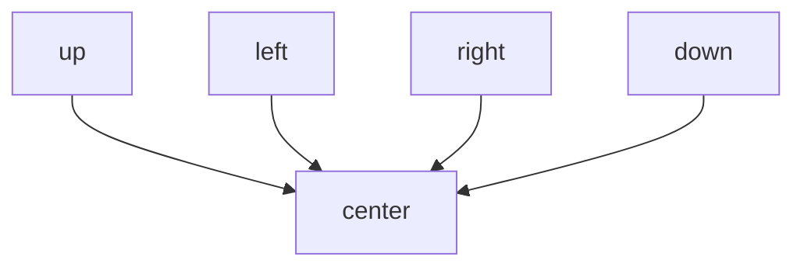

# Gray-Scott Basics

## What is being simulated?

The Gray-Scott model tracks two quantities, usually called `u` and `v`.

You can think of them as two chemical concentrations spread across a 2D grid.
Each cell in the grid stores one `u` value and one `v` value.

Over time, those values change because of two effects:

- **diffusion**: values spread to nearby cells,
- **reaction**: `u` and `v` interact locally through nonlinear rules.

## The math idea in one picture

At each time step, each cell is updated using:

```text
new value
  = old value
  + diffusion effect from neighbors
  + local reaction effect
  + feed/kill terms
```

For this project, the important mental model is:

```text
nearby cells matter   +   local chemistry matters   +   time repeats
```

That repeated local update is enough to create large visible patterns.

## Why do patterns appear?

If the reactions and diffusion rates balance in the right way, the system stops
being visually uniform. Spots, worms, stripes, and other textures appear.

That makes Gray-Scott useful for both:

- science and numerical methods,
- visual teaching and browser demos.

## What parameters matter most here?

This project keeps many parameters fixed and focuses on two:

- `F`: feed rate
- `k`: kill rate

Those two are the stars of the inverse problem.

You can read them in beginner language like this:

- `F` says how strongly fresh `u` material is supplied,
- `k` says how strongly `v` is removed.

Changing them changes the balance of the system.

The inverse question is:

> If I see a final pattern, can I work backward and recover the `F` and `k`
> values that probably generated it?

## Why is that hard?

Because the final pattern is not a simple formula.

- small parameter changes can alter behavior,
- different parameter pairs can sometimes look similar,
- noise makes the problem harder,
- local optimization can get stuck or drift.

That is why the repo does not only show final recovered parameters. It also
measures losses, gradients, overhead, and failure behavior.

## What is the grid?

The simulation lives on a 2D rectangular lattice such as:

- `64 x 64`
- `128 x 128`
- `256 x 256`
- `512 x 512`

Each grid cell stores floating-point values for `u` and `v`.

## A cell-update diagram

The update at one cell uses a 5-point neighborhood:



So the solver is always doing two things at once:

1. looking locally around each cell,
2. repeating that local rule across the whole grid.

## What is the seed?

The simulation starts from a mostly uniform field and then inserts a small
center square with different values. That seed creates the disturbance that
starts the pattern.

This matters because if the initial condition were changed, the final pattern
could also change. That is one reason the paper is careful about its limits.

## Why this is a good teaching model

Gray-Scott is popular in teaching because the equations are small enough to
study, but the output is rich enough to feel surprising.

That makes it a strong example for learning:

- nonlinear dynamics,
- grid-based simulation,
- floating-point computation,
- inverse problems,
- browser-delivered scientific software.
