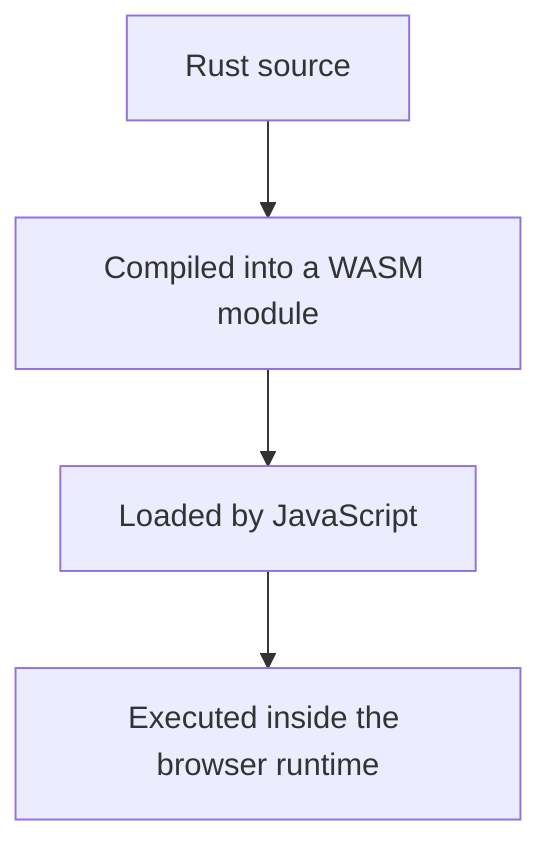
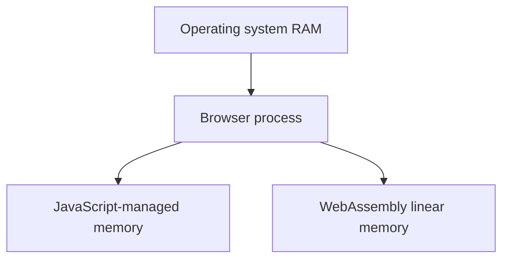
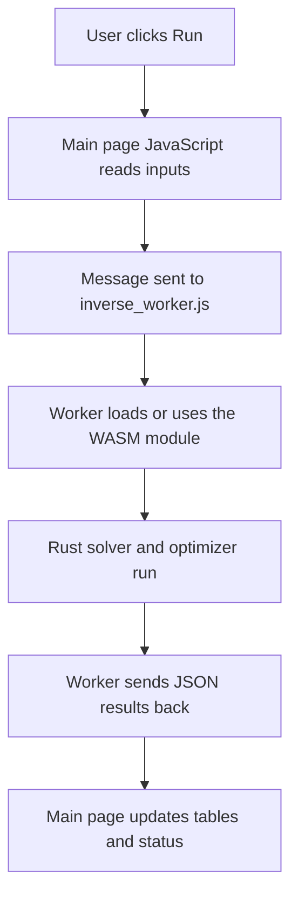

# Rust and WebAssembly

## Why Rust?

Rust gives this project three useful things:

- predictable performance,
- explicit memory control,
- good support for native binaries and WebAssembly builds from the same codebase.

That makes it a strong fit for a solver that must:

- run locally for validation,
- compile to WASM for browsers,
- stay readable enough for research reproduction.

## What is WebAssembly?

WebAssembly, or WASM, is a binary format that browsers and other runtimes can
execute efficiently.

For this project, that means:

- the solver can run in the browser,
- the same core numerical logic can be reused,
- JavaScript becomes the UI and orchestration layer rather than the only compute
  layer.

## What does “running in the browser” actually mean?

It does **not** mean the Rust code becomes ordinary JavaScript source.

It means:

So the browser app still has multiple layers:

- HTML for the page structure,
- JavaScript for UI and browser APIs,
- WASM for heavy numerical work,
- Rust as the source language behind that WASM module.

## Why not just use JavaScript?

You could. In fact, this repo includes a scalar JS baseline.

But Rust/WASM is useful when you want:

- more control over memory layout,
- a clearer path to native and browser reuse,
- easier integration of low-level optimizations such as SIMD,
- a systems-style artifact rather than only a browser demo.

## What is the JS/WASM boundary?

The browser page is still JavaScript.

WASM does not replace the whole app. Instead:

- JavaScript handles the page, controls, and browser APIs,
- WASM handles heavy numerical work,
- values cross the boundary between them.

That boundary matters because copying large arrays back and forth can be slow.
This repo explicitly measures and designs around that issue.

## Where is the memory actually living?

This is an important beginner question.

At the machine level, the operating system gives memory to the browser process.
Inside that browser process, the JavaScript engine and the WASM runtime manage
their own memory regions.

You can picture it like this:

So WASM is using real machine memory, but it is doing so through the browser's
runtime and safety boundaries, not by reading arbitrary OS memory directly.

## What is WebAssembly linear memory?

Think of it as a large byte buffer owned by the WASM module.

The Rust code stores arrays in that memory. JavaScript can then look at parts
of the same buffer through typed arrays such as `Float32Array` or
`Uint8ClampedArray`.

That is how this project avoids unnecessary copies for large simulation fields.

## Why is CPU-first still a reasonable choice?

Because the artifact question here is about portability and inspectability as
much as raw speed.

CPU-first means:

- the same logic runs natively and in-browser,
- the hardware assumptions stay modest,
- debugging and validation stay simpler,
- students can reason about the path more directly.

GPU compute is not “bad” or “less real.” It is simply a different engineering
tradeoff with more infrastructure and more backend complexity.

## What is zero-copy access here?

The project exposes field views from WASM memory to JavaScript using typed
arrays. That avoids copying a whole field every time the page wants to read it.

This is one of the most important systems ideas in the repo:

- copying is simple but expensive,
- views are faster but need more care.

## Why is the browser inverse loop in a Web Worker now?

Browsers have a main thread that handles page interaction and rendering.

If you run a heavy inverse optimization directly on that thread:

- the page can freeze,
- buttons and scrolling feel blocked,
- the site feels less credible as a real browser artifact.

A Web Worker moves that heavy computation off the main thread.

In this repo:

- `www/inverse.js` runs the UI,
- `www/inverse_worker.js` runs the inverse optimizer,
- the worker returns JSON results back to the page.

That is a classic browser systems pattern: keep the UI responsive by moving
compute elsewhere.

## A full browser-side flow diagram

